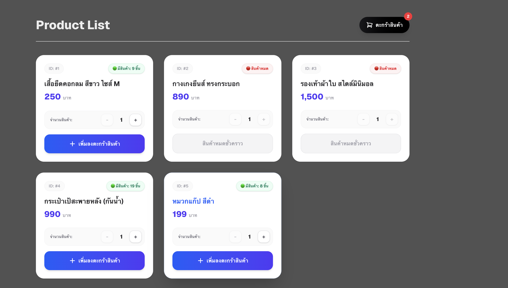
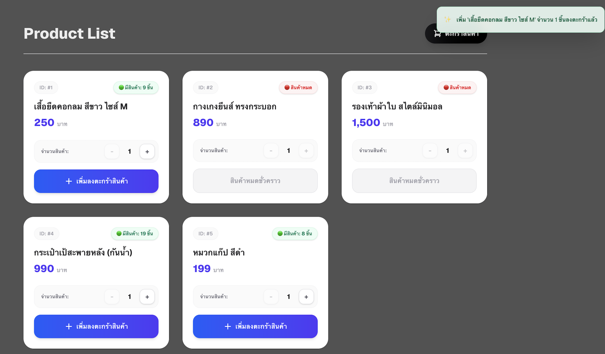
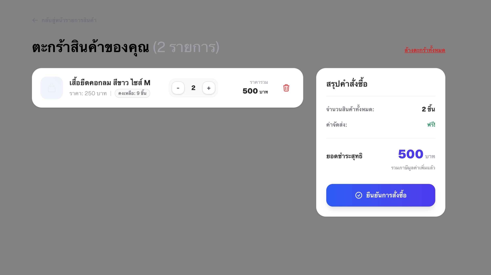
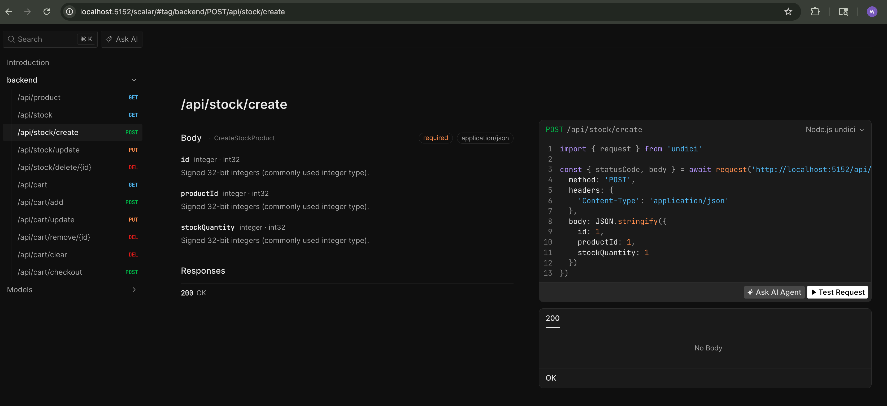
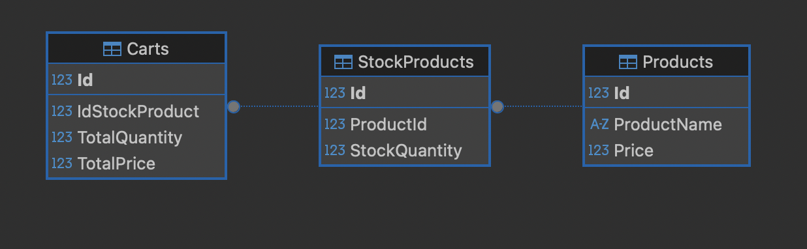

# projectDotNet

E-commerce demo: .NET minimal API backend + Next.js frontend + MariaDB.

## Architecture

```
Browser → Next.js (:3000) → Next API routes (/api/*) → .NET API (:5152) → EF Core → MariaDB (:3306)
```

| Layer | Stack | Path | Port |
|-------|-------|------|------|
| Frontend | Next 16, React 19, Tailwind 4 | `frontend/` | `3000` |
| Backend | .NET minimal API, EF Core, Pomelo MySQL | `backend/` | `5152` |
| Database | MariaDB 11 (Docker) | `docker-compose.yml` | `3306` |

## Prerequisites

- [Docker](https://docs.docker.com/get-docker/) + Docker Compose
- [.NET SDK](https://dotnet.microsoft.com/download) 9.0+
- [Node.js](https://nodejs.org/) 20+

## Install & Run

Run each step in its own terminal (DB first).

### 1. Database

```bash
docker compose up -d
docker compose ps        # wait for STATUS = healthy
```

### 2. Backend (.NET API → http://localhost:5152)

```bash
cd backend
dotnet restore
dotnet run --launch-profile http
```

Tables are created and demo data seeded automatically on first run
(`EnsureCreated`). Connection string lives in `backend/appsettings.json`.

### 3. Frontend (Next.js → http://localhost:3000)

```bash
cd frontend
npm install
npm run dev
```

The frontend calls the backend via `NEXT_PUBLIC_API_URL`
(default `http://localhost:5152`). Override in `frontend/.env` if needed.

## Usage

1. Open <http://localhost:3000> — browse the product list.
2. Adjust quantity and add items to the cart (stock is validated).
3. Open the cart to update quantities, remove items, or clear it.
4. Checkout decrements stock in a transaction and empties the cart.

### Screenshots

**Product list** — stock badges and per-item quantity selector:



**Add to cart** — toast confirmation and live cart badge:



**Cart** — update quantity, remove items, and order summary:



### API endpoints (backend)

| Method | Route | Purpose |
|--------|-------|---------|
| GET | `/api/product` | List products with stock |
| GET | `/api/stock` | List stock entries |
| POST | `/api/stock/create` | Create stock entry |
| PUT | `/api/stock/update` | Update stock entry |
| DELETE | `/api/stock/delete/{id}` | Delete stock entry |
| GET | `/api/cart` | List cart items |
| POST | `/api/cart/add` | Add item to cart |
| PUT | `/api/cart/update` | Update cart quantity |
| DELETE | `/api/cart/remove/{id}` | Remove cart item |
| DELETE | `/api/cart/clear` | Clear cart |
| POST | `/api/cart/checkout` | Checkout (decrement stock) |

In Development, OpenAPI/Scalar docs are served by the backend:



## Database

### Schema



### Credentials

| Field | Value |
|-------|-------|
| Host | `127.0.0.1` (or `mariadb` from inside container) |
| Port | `3306` |
| Database | `testdb` |
| User | `testuser` |
| Password | `testpass` |
| Root password | `rootpass` |

> Override via env vars in `docker-compose.yml`. Do **not** use these in production.

### Stop

```bash
docker compose stop      # stop, keep data
docker compose down      # remove containers, keep volume
docker compose down -v   # remove + wipe data
```

### Connect

```bash
# From host
mysql -h 127.0.0.1 -P 3306 -u testuser -ptestpass testdb

# Inside container
docker compose exec mariadb mariadb -u testuser -ptestpass testdb
```

### Troubleshooting

| Problem | Fix |
|---------|-----|
| Port 3306 in use | Change host port in `docker-compose.yml`: `"3307:3306"` |
| Backend can't connect | Wait for DB `healthy` status, then restart backend |
| Forgot password | `docker compose down -v` (wipes data) |
